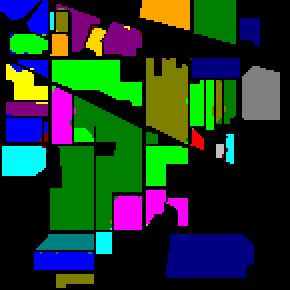
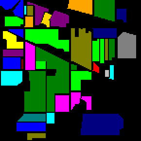
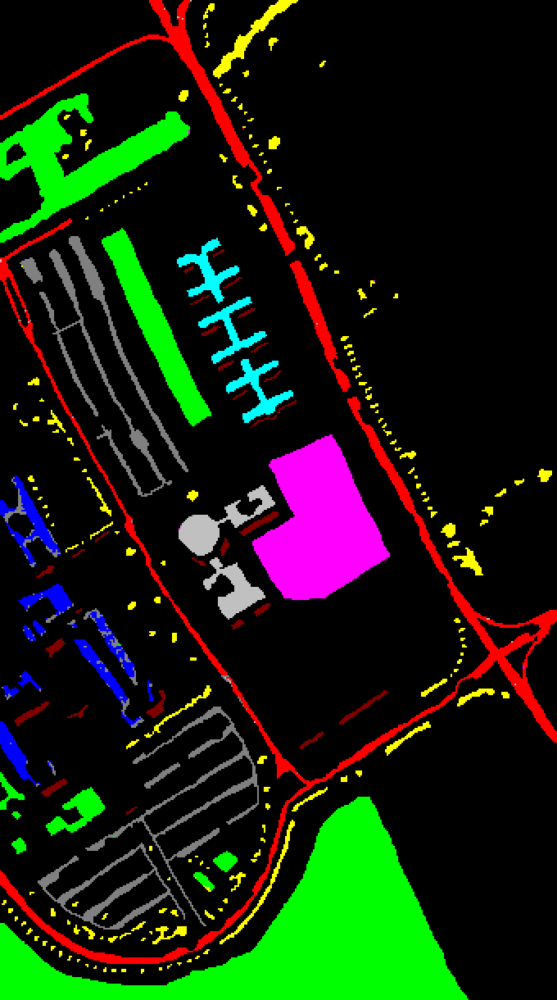
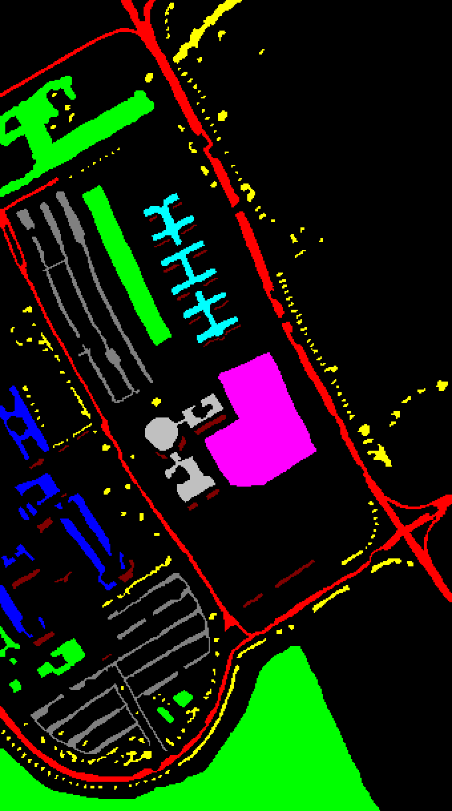
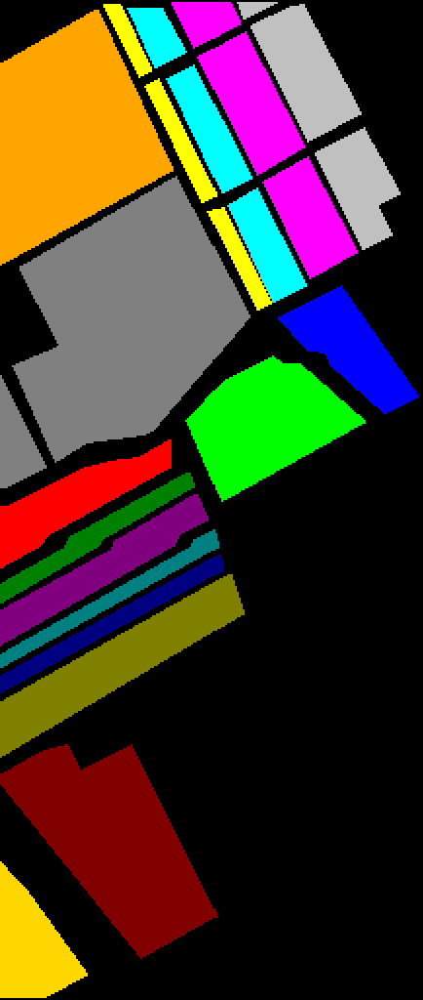

# Multi-Kernel-Rotated-Conv-Deconv-Feature-Fusion-SSRN3d

This repository contains a PyTorch implementation of modified version of SSRN 3d.  

1. In the main structure of the model, there are 4 residual blocks. Each residual block contains 3d convolutions. After the residual blocks end, there is a max-pooling layer and then the dense layer which gives the output of the network. There was no 2d feature representation or learning in the model earlier. Still it was able to yield reasonably good results. For the improvements of the results I have decided to incorporate some 2d blocks for 2 dimensional feature learning. So I have taken the output from the 2nd residual block, reshaped it and used Conv2d. The same output from the 2nd residual network after reshaping is rotated 90 degrees and passed through FastDeconv2d parallelly. Then they are concatenated using Max Fusion. Then traditional concatenation is done with the output of the maxpooling layer of the main network. I haven't used deconvolutional layers earlier than 2nd residual layers as it was too early a stage in the model for 3d feature learning. The novelty of the model is that rotation of features and then applying convolutional layers. Rotation is deployed to give a constrained input to the deconvolution layer so it can learn from a different angle of features(and remove pixel-wise and channel wise correlations also) along with the convolutional layer parallelly.  
2. I have tested various numbers of layers and finally have concluded that usage of 3 convolution and deconvolution layers give the best performance. Similarly I have tested various fusions and found then max fusion and then concatenation give the best results.

## Results

### Indian Pines (IP) dataset
   
Fig 1. (a)Classification map, (b)Ground truth label 

mean_OA ± std_OA is: 0.9809651365721012 ± 0.0013787319088812515 
mean_AA ± std_AA is: 0.9340486216787586 ± 0.0032418305422038463 
mean_KAPPA ± std_KAPPA is: 0.9783164461210337 ± 0.0015760847465849112 

10% samples were used for training.

### University of Pavia (UP) dataset
   
Fig 1. (a)Classification map, (b)Ground truth label 

mean_OA ± std_OA is: 0.9899801355456882 ± 0.0025362718007885376 
mean_AA ± std_AA is: 0.9845783986515291 ± 0.0036271636518355483 
mean_KAPPA ± std_KAPPA is: 0.9867305543047306 ± 0.0033544515252394813 

10% samples were used for training.

### Salinas Scene (SS) dataset
   
Fig 1. (a)Classification map, (b)Ground truth label 

mean_OA ± std_OA is: 0.9622542796691672 ± 0.003240080275321495 
mean_AA ± std_AA is: 0.9846370620302208 ± 0.0020065630930044772 
mean_KAPPA ± std_KAPPA is: 0.9579490426872841 ± 0.0036159979607129932 

10% samples were used for training.
